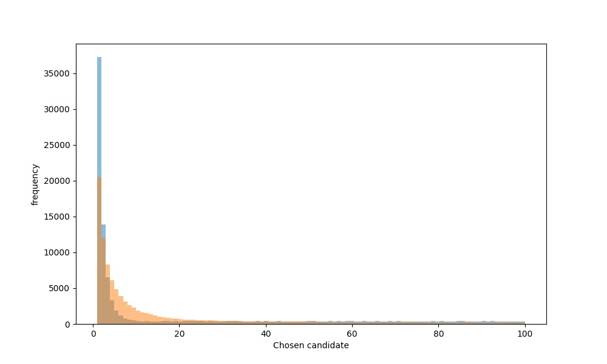

# Задача о разборчивой невесте 
a.ka. Secretary Problem
## Задача
### Описание:
1. Невеста ищет себе жениха (существует единственное вакантное место).
2. Число претендентов - N.
3. Невеста общается с претендентами в случайном порядке, с каждым не более одного раза.
4. О каждом претенденте известно, лучше он или хуже любого из предыдущих.
5. Пообщавшись с претендентом, невеста сравнивает его с предыдущими и либо отказывает, либо принимает его предложение. Если предложение принято, они женятся и процесс останавливается. Если невеста отказывает жениху, то вернуться к нему позже она не сможет.
6. Невеста выигрывает, если она выберет самого лучшего претендента. Выбор даже второго по порядку сравнения — проигрыш.

### Задача:
1. Разработать и обучить нейронную сеть, которая возьмет на себя роль невесты и будет решать принять предложение или отказать очередному жениху.
2. Сравнить результат принятия решения обученной нейронной сети и оптимальным математическим алгоритмом.
## Решение
### Структура
```
│   candidates_generator.py - генератор списка кандидатов
│   main.py
│
├───math_solution - решение с помощью классического математического алгоритма
│       main.py
│       __init__.py
│
└───reinforcement_learning - решение с помощью обучения с подкреплением
        agent.py - агент обучения с подкреплением
        environment.py - среда, в которой агент решает задачу
        main.py
        __init__.py
```
### Результат
Математический алгоритм решает задачу с вероятностью 37%, алгоритм обучения с подкреплением (Q-learning) ~20%.
