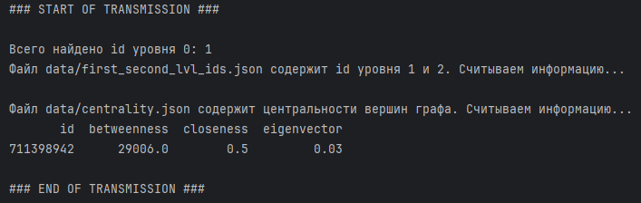
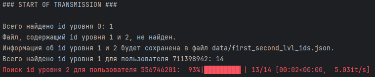
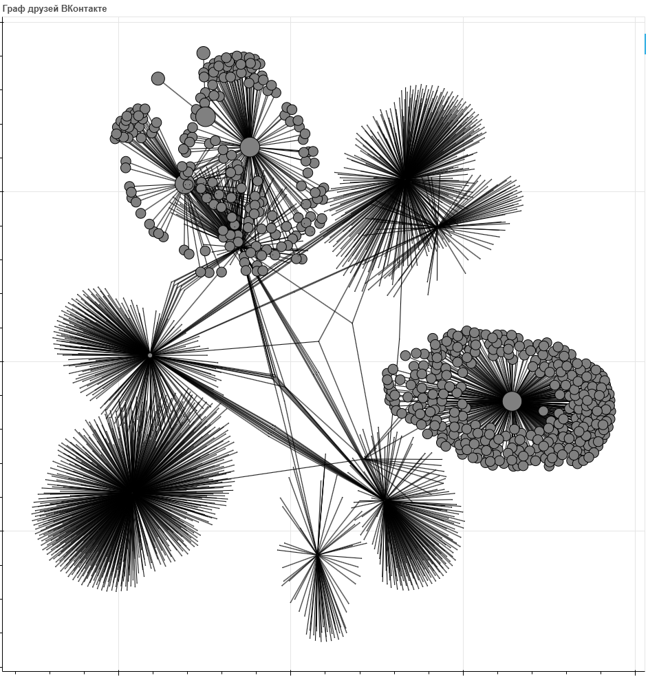

# Граф друзей ВКонтакте
- [x] Собирает датасет друзей и друзей друзей (модуль `scraper`)
- [x] Определяет центральность (по посреднечеству, по близость, собственного вектора) и выводит её (модуль `centrality`)
- [x] Визуализирует получившийся граф (модуль `graph_draw`)
## Крутые функции
- Красивый вывод в консоль на русском языке!

- Прогресс-бары на базе tqdm для всех нагруженных циклов!

- Оптимизация: расчёт центральностей до 5 раз быстрее!* (*по сравнению с использованием стандартной библиотеки `networkx`)
## Результат работы

## Как пользоваться
- Получить токен
	- Для этого перейти по [ссылке](https://oauth.vk.com/authorize?client_id=6478436&display=page&redirect_uri=https://oauth.vk.com/blank.html&scope=friends&response_type=token&v=5.95), нажать на кнопку "Продолжить как";
	- Скопировать данные из адресной строки, а именно - значение параметра `access_token` ЦЕЛИКОМ (включая `vk1.a.<символы>`).
- Создать в корне программы файл с названием `.env` и вставить туда строку `TOKEN=access_token`, где вместо `access_token` подставить значение параметра из предыдущего пункта.
- Запустить скрипт.
## Проблемы
Скрипт может требовать для работы библиотеки помимо тех, что указаны в requirements.txt. Если это вызывает ошибку, нужно установить требуемые библиотеки.